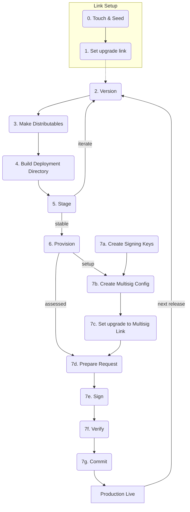

# hello-pear-qvac

> Local AI in your terminal: [Bare] + [QVAC] on-device inference + a [bare-tui] interface, with peer-to-peer OTA updates.

Ask a question, watch a model answer — running **on your machine**. No API key, no
network round-trip, no cloud.

```
╭──────────────────────────────────────────────────────────────────╮
│ ◆ hello-pear-qvac  v0.0.0-rc.0                                   │
│ model LLAMA_3_2_1B_INST_Q4_0   ready                             │
╰──────────────────────────────────────────────────────────────────╯
 LLAMA_3_2_1B_INST_Q4_0 loaded — ask it anything.

 ❯ Name one ocean. Answer in 3 words.

 Pacific Ocean

╭──────────────────────────────────────────────────────────────────╮
│ ❯ ask the model something…                                       │
╰──────────────────────────────────────────────────────────────────╯
  ↵ send · ctrl+t thinking · pgup/pgdn scroll · ctrl+c quit
```

This is a **template**. The plumbing is finished — ~540 lines of CLI, worker and
IPC you can leave alone — and the ~620-line UI on top is meant to be thrown away.
Chat is just the demo; see [Remix it](#remix-it).

## Run it

```sh
npm install
npm start
```

First run downloads ~1 GB of model weights and caches them, so it takes a while;
later runs start in seconds.

Any other model is one flag away — see [Models that work out of the
box](#models-that-work-out-of-the-box):

```sh
npm start -- --model QWEN3_1_7B_INST_Q4
```

| key           | does                                    |
| ------------- | --------------------------------------- |
| `↵`           | send                                    |
| `esc`         | interrupt the answer being generated    |
| `ctrl+t`      | show/hide a thinking model's reasoning  |
| `pgup`/`pgdn` | scroll the transcript (mouse wheel too) |
| `ctrl+c`      | interrupt if busy, otherwise quit       |

Needs `npm` via [Node.js][nodejs] and [Bare][bare] (`npm i -g bare-runtime`).
Runs on macOS, Linux and Windows, arm64 and x64; QVAC ships native prebuilds for
each and picks up GPU acceleration (Vulkan, Metal) where it exists.

## What's here

```
bin.mjs               CLI flags, and the only place workers meet the UI
├── ui/app.js         the whole UI — state, keys, layout    ← change how it looks
│   └── transcript.js drawing one conversation entry
├── lib/inference.js  client for the inference worker
│   └── workers/qvac.js   loads the model, streams tokens   ← change what you ask
├── app.js            client for the OTA update worker
│   └── workers/main.js   the OTA update worker
└── test/index.js     headless tests — no model, no GPU, ~150 ms
```

Two workers, one pattern. Each runs in its own Bare thread via
`PearRuntime.run(...)` and is spoken to over a `FramedStream`; `lib/inference.js`
is deliberately the same shape as `app.js`, so learning one teaches you the other.

Inference gets a thread because **loading a GGUF blocks the thread it runs on**
for seconds — in-process, the spinner visibly stutters. Generation itself is
async and never blocks.

## How one question flows

Press enter, and the answer comes back through four layers. This is the whole
architecture, once:

```
1  ui/app.js       _submit()      push an entry, return an `ask` Cmd
2  lib/inference.js ask()         { t:'ask', id, history }  →  over the pipe
3  workers/qvac.js  ask()         sdk.completion({ modelId, history })
4  workers/qvac.js  contentDelta  { t:'delta', id, text }   ←  back over the pipe
5  lib/inference.js _onmessage()  emits 'delta'
6  bin.mjs          bridge        program.send({ type:'qvac.delta', ... })
7  ui/app.js        update()      append to the live entry
8  ui/app.js        view()        repaint
9  workers/qvac.js  run.final     { t:'end', id, stopReason } settles it
```

The `id` is how a late token from an interrupted answer gets dropped instead of
appended to the next one.

**The load-bearing rule is that `ui/app.js` never imports the QVAC SDK.** That is
why the tests run in 150 ms with no model and no GPU.

One JSON object per frame, `t` is the tag:

| direction | frame                            | meaning                           |
| --------- | -------------------------------- | --------------------------------- |
| →         | `{ t:'ask', id, history }`       | answer this conversation          |
| →         | `{ t:'cancel', id }`             | stop that answer                  |
| →         | `{ t:'close' }`                  | unload the model and shut down    |
| ←         | `{ t:'progress', percentage }`   | model download, 0–100             |
| ←         | `{ t:'loaded', model, ctxSize }` | resident and ready                |
| ←         | `{ t:'thinking', id, text }`     | reasoning, from a thinking model  |
| ←         | `{ t:'delta', id, text }`        | a token of the answer             |
| ←         | `{ t:'end', id, stopReason }`    | finished, cancelled, or cut short |
| ←         | `{ t:'error', id, message }`     | something went wrong              |
| ←         | `{ t:'closed' }`                 | safe to terminate the thread      |

Adding a message type means touching those same four files, in that order.

## The two knobs that matter

```sh
npm start -- --model QWEN3_4B_INST_Q4_K_M --ctx 16384
```

**`--model`** — any model constant exported by `@qvac/inference`. Nothing else
changes. The default lives in `package.json` under `qvac.model`.

**`--ctx`** — everything the model holds at once shares this budget: the
conversation so far, its reasoning, and the answer it is writing. ⚠️ **The
addon's default is 1024 tokens**, small enough that a couple of turns leave no
room to reply and answers stop mid-sentence. This template sets `8192`. If an
answer does hit the ceiling the app says so rather than pretending the model
finished.

### Models that work out of the box

Every one of these is a `llamacpp-completion` model, which is the plugin this
template already registers — no new dependency, no code change, just the flag.
Sizes are the download; the model is cached after the first run.

| Model                        | Size     | Good for                                                               |
| ---------------------------- | -------- | ---------------------------------------------------------------------- |
| `QWEN3_600M_INST_Q4`         | 0.38 GB  | a _thinking_ model that fits in a pocket; try `ctrl+t`                 |
| `SMOLLM2_360M_INST_Q8`       | 0.39 GB  | the fastest thing here — smoke tests, CI, weak hardware                |
| `LLAMA_3_2_1B_INST_Q4_0`     | 0.77 GB  | the default — a good general baseline                                  |
| `QWEN3_1_7B_INST_Q4`         | 1.06 GB  | noticeably better answers, still fast                                  |
| `QWEN3_4B_INST_Q4_K_M`       | 2.50 GB  | the sweet spot on most laptops                                         |
| `HEALTHCARE_4B_MEDICAL_Q8_0` | 4.69 GB  | domain-tuned and reasoning-heavy — what a specialised model looks like |
| `QWEN3_8B_INST_Q4_K_M`       | 5.03 GB  | the largest that stays comfortable on a 16 GB machine                  |
| `GPT_OSS_20B_INST_Q4_K_M`    | 11.62 GB | wants a real GPU; expect a long first download                         |

```sh
npm start -- --model HEALTHCARE_4B_MEDICAL_Q8_0
```

Rules of thumb: **Q4 is the everyday quantisation**, Q8 is bigger and slightly
better, and anything above ~4B on an integrated GPU runs at a few tokens per
second. A reasoning model spends its first hundreds of tokens thinking, so give
it context — `--ctx 8192` or more.

There are 37 text models in the registry, plus vision, speech, embedding and
image-generation ones that need a different plugin (see
[Different engine](#different-engine)). To list the text models your installed
version offers, smallest first — save as `models.mjs` and run `bare models.mjs`:

```js
const m = await import('@qvac/inference')
const rows = Object.entries(m)
  .filter(([k, v]) => v?.engine === 'llamacpp-completion' && !/SHARD|TENSORS|MULTIMODAL/.test(k))
  .map(([k, v]) => [(v.expectedSize / 1e9).toFixed(2) + ' GB', v.params, k])
  .sort((a, b) => parseFloat(a[0]) - parseFloat(b[0]))
for (const r of rows) console.log(r[0].padStart(8), String(r[1]).padStart(6), r[2])
```

## Remix it

### Same engine, different app

Most ideas need no new dependency — just a different prompt and output format in
`ask()` (`workers/qvac.js`):

| Build                           | Change                                                    |
| ------------------------------- | --------------------------------------------------------- |
| Text adventure, dungeon master  | a system prompt; `responseFormat` for the game state      |
| NPC dialogue                    | one `completion()` per character, a system prompt each    |
| 20 questions, word games        | `responseFormat`, so a turn parses instead of scans       |
| An agent that runs things       | `tools` on `completion()`; execute in the worker and loop |
| Commit messages, diff explainer | pipe stdin in as the first history entry, drop the TUI    |
| Notes or journal summariser     | same, plus `hyperbee` to keep a long document resident    |

`responseFormat` is the unlock for anything game-shaped: the model hands back
parseable state instead of prose you have to regex.

### Different engine

`workers/qvac.js` registers exactly one plugin — nothing you don't register is
linked in. Swap those two lines and install the peer dependency:

| Plugin                     | Peer dependency                                      | Build                      |
| -------------------------- | ---------------------------------------------------- | -------------------------- |
| `llamacpp-completion`      | `@qvac/llm-llamacpp` + `@qvac/langdetect-text`       | chat, games, agents (here) |
| `llamacpp-embedding`       | `@qvac/embed-llamacpp`                               | offline semantic search    |
| `whispercpp-transcription` | `@qvac/asr-ggml`                                     | voice notes, live captions |
| `tts-ggml`                 | `@qvac/tts-ggml`                                     | read answers aloud         |
| `nmtcpp-translation`       | `@qvac/translation-nmtcpp` + `@qvac/langdetect-text` | an offline translator      |
| `sdcpp-generation`         | `@qvac/diffusion-cpp`                                | sprite and asset generator |
| `ggml-ocr`                 | `@qvac/ocr-ggml`                                     | screenshot → text          |
| `ggml-classification`      | `@qvac/classification-ggml`                          | inbox triage, tagging      |

Two traps, both cheap to avoid: peer dependencies are declared **optional**, so
npm won't install them and a missing one shows up as `MODULE_NOT_FOUND` at
runtime — install it explicitly. And npm's caret on a `0.x` version excludes the
next minor, so `latest` can land outside the `^0.45.0` the SDK pins.

The full table, including the non-obvious transitive peers, is in
[CLAUDE.md](CLAUDE.md).

### Just the SDK

None of the above needs this template. The whole SDK, standalone:

```js
import {
  registerPlugin,
  loadModel,
  completion,
  unloadModel,
  close,
  LLAMA_3_2_1B_INST_Q4_0
} from '@qvac/inference'
import { llmPlugin } from '@qvac/inference/llamacpp-completion/plugin'

registerPlugin(llmPlugin)

const modelId = await loadModel({
  modelSrc: LLAMA_3_2_1B_INST_Q4_0,
  modelConfig: { ctx_size: 8192 }
})

const run = completion({ modelId, history: [{ role: 'user', content: 'Hi' }] })
for await (const event of run.events) {
  if (event.type === 'contentDelta') console.log(event.text)
}

await unloadModel({ modelId })
await close()
```

The file count here is the _app_, not the SDK.

### Delete what you don't need

No OTA updates? Delete `app.js` and `workers/main.js`, then remove every `app`
reference in `bin.mjs` — the import, the `new App(...)`, `onApplyUpdate`, the
`if (app)` block, and the two in `teardown()`/startup — plus `this.updater` and
`onApplyUpdate` in `ui/app.js`. Grepping for `app` and `updater` finds the lot.

No TUI? `lib/inference.js` is a standalone client — `new Inference({ model })`,
`await ready()`, `ask(history)`, listen for `delta`.

## The UI

`ui/app.js` is a plain [bare-tui] model: state in the constructor, messages
folded in `update()`, a pure `view()`. It knows nothing about QVAC — inference
reaches it as the `qvac.*` messages above.

To change it, read [bare-tui's CLAUDE.md][bare-tui-claude], or hand that file to
your coding agent along with what you want. The message table above is the entire
contract a replacement has to honour.

## Updates

Off by default until you supply a key. Create one with
[`pear touch`](https://docs.pears.com/reference/cli.html#pear-touch-flags-channel),
paste it into `package.json`'s `upgrade`, then `npm start -- --updates`.

`app.js` stages a new build but never applies it — nothing swaps out from under a
conversation. [bare-tui-updater] renders the confirm prompt and `bin.mjs` connects
the two in one line:

```js
wire(ui.updater, { updater: app, send: program.send.bind(program) })
```

`ctrl+r` applies, `esc` dismisses. To ship a standalone: set `upgrade`, then follow
[hello-pear-electron from step 4](https://github.com/holepunchto/hello-pear-electron#4-build-deployment-directory-),
and install with `npx pear-install pear://<key>`.

## Build and ship

### Building

- `npm start` — dev mode (`bare bin.mjs --no-updates`)
- `npm test` — headless tests, no model required
- `npm run lint` / `npm run format` — prettier and lunte
- `npm run make` — standalone binary for this host into `out/make`
- `npm run make:<platform>-<arch>` — a specific target (`HOST=linux-arm64` also works)

`npm run make` picks up the signing credentials from the
[`make-pear-app` GitHub Action][make-pear-app]: `MAC_CODESIGN_IDENTITY` (plus
`KEYCHAIN_PROFILE` to notarize) on macOS, `WINDOWS_CERT_SHA1` on Windows.

### Shipping

Use the [`pear`][pear-docs] CLI to deploy applications.

The full release flow — stage, provision, and multisig — plus the Foundational Steps, release lines, and per-OS build/signing details now live in the Pear docs:

- [Deploy your application](https://docs.pears.com/how-to/operate-an-app/manual-deployment/deployment) — the eight Foundational Steps, command by command
- [Release pipeline](https://docs.pears.com/explanation/deployment-releasing-apps-p2p) — why stage, provision, and multisig exist and how they chain together
- [Build desktop distributables](https://docs.pears.com/how-to/operate-an-app/build-and-package/build-desktop-distributables) — macOS, Windows, and Linux signing and notarization

The Foundational Steps bootstrap the deployment and then feed into the repeating release cycle:



## Troubleshooting

| Symptom                                    | Cause / fix                                                                |
| ------------------------------------------ | -------------------------------------------------------------------------- |
| `ggml_vulkan: …` printed over the UI       | llama.cpp writes to fd 2 below any JS logger; `bin.mjs` repaints. Harmless |
| Stuck at 0% on first run                   | fetching ~1 GB — it updates as blocks arrive                               |
| Answers stop mid-sentence, worse each turn | context window full — raise `--ctx`                                        |
| Raw `<think>` tags in the reply            | `captureThinking` is off for that call — see `ask()`                       |
| `INVALID_URL 'pear://<YOUR_KEY_HERE>'`     | the updater ran with the placeholder key — run `pear touch`                |
| Hangs on exit                              | the model must be unloaded first — that's the `close` handshake            |
| Out of memory, or a few tokens/second      | smaller model or quantisation via `--model`                                |
| An update downloaded but nothing happened  | the confirm gate — press `ctrl+r`; relaunch to run the new build           |
| Banner shows no version number             | `hello-pear-worker` doesn't forward `nextVersion` over the pipe            |

## Also

[CLAUDE.md](CLAUDE.md) — how to extend this template, the invariants worth
keeping, and every trap this repo has already hit and fixed. Point your agent at
it before asking for changes.

<!-- Reference Links -->

[Bare]: https://github.com/holepunchto/bare
[bare]: https://github.com/holepunchto/bare
[bare-tui]: https://github.com/holepunchto/bare-tui
[bare-tui-updater]: https://github.com/holepunchto/bare-tui-updater
[bare-tui-claude]: https://github.com/holepunchto/bare-tui/blob/main/CLAUDE.md
[QVAC]: https://qvac.tether.io
[nodejs]: https://nodejs.org
[make-pear-app]: https://github.com/holepunchto/actions/tree/main/make-pear-app
